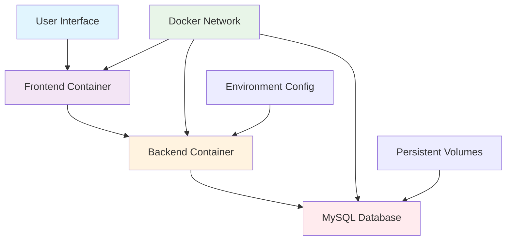

# 🛒 Shared Shopping List - Collaborative Shopping Made Easy

<div align="center">


**Streamlining collaborative shopping experiences**

🚀 Live Demo • 📋 Features • 🏗️ Architecture • 🐳 Docker Setup • 🤝 Contributing

</div>

---

## 🌐 Overview

**Shared Shopping List** is a modern web application that enables seamless collaboration between users for managing shared shopping lists. Built with a containerized microservices architecture, it provides real-time synchronization, user authentication, and intuitive list management capabilities.

**🎯 Key Benefits:**
- 👥 Multi-user collaboration on shopping lists
- 🔄 Real-time synchronization across devices
- 🔐 Secure user authentication and authorization
- 📱 Responsive design for all devices
- 🐳 Containerized deployment with Docker

```
┌─────────────┐    ┌─────────────┐    ┌─────────────┐    ┌─────────────┐
│   Frontend   │ ──► │   Backend   │ ──► │   Database  │ ──► │   Storage   │
│   (React)    │    │  (Node.js)  │    │   (MySQL)   │    │(Persistent) │
└─────────────┘    └─────────────┘    └─────────────┘    └─────────────┘
```

## ✨ Features

### 🔧 Core Capabilities
- **👤 User Management**: Secure registration and authentication
- **📝 List Creation**: Create and manage multiple shopping lists
- **🤝 Collaboration**: Share lists with multiple users
- **✅ Item Management**: Add, edit, and mark items as completed
- **🔄 Real-time Sync**: Instant updates across all connected devices

### 📈 Technical Features
- 🏗️ **Microservices Architecture**: Scalable container-based design
- 🔐 **JWT Authentication**: Secure token-based authentication
- 📊 **RESTful APIs**: Clean and well-documented API endpoints
- 🐳 **Docker Containerization**: Easy deployment and scaling
- 📱 **Responsive UI**: Optimized for desktop and mobile

## 🏗️ System Architecture



## 🚀 Quick Start

### Prerequisites

```bash
# Required software
- Docker
- Docker Compose
- Git
```

### Installation & Setup

1. **Clone the Repository**
   ```bash
   git clone https://github.com/your-username/shared-shopping-list.git
   cd shared-shopping-list
   ```

2. **Environment Configuration**
   ```bash
   # Create .env file with required variables
   cp .env.example .env
   
   # Edit .env with your configuration
   DB_USER=your_db_user
   DB_PASSWORD=your_secure_password
   DB_NAME=shopping_list_db
   JWT_SECRET=your_jwt_secret
   FRONTEND_URL=http://localhost:3000
   BACKEND_PORT=5000
   HOST_IP=localhost
   ```

3. **Run with Docker Compose**
   ```bash
   # Build and start all services
   docker-compose up --build
   
   # Run in detached mode
   docker-compose up -d
   ```

4. **Access the Application**
   - Frontend: http://localhost:3000
   - Backend API: http://localhost:5000
   - Database: localhost:3306

## 💻 Project Structure

````
shared-shopping-list/
├── 🐳 docker-compose.yml        # Container orchestration
├── 📝 .env.example              # Environment variables template
├── 📂 frontend/                 # React frontend application
│   ├── 🐳 Dockerfile
│   ├── 📦 package.json
│   ├── 🏠 public/
│   └── ⚛️ src/
│       ├── 📱 components/
│       ├── 📄 pages/
│       ├── 🔧 services/
│       └── 🎨 styles/
├── 📂 backend/                  # Node.js backend API
│   ├── 🐳 Dockerfile
│   ├── 📦 package.json
│   ├── 🗃️ init.sql              # Database initialization
│   ├── 🛣️ routes/
│   ├── 🔧 middleware/
│   ├── 🗄️ models/
│   └── ⚙️ config/
└── 📖 README.md
````

## 🐳 Docker Configuration

### Service Overview

The application consists of three main services orchestrated with Docker Compose:

````yaml
services:
  # React Frontend (Port 3000)
  frontend:
    - Nginx-served React application
    - Build-time backend URL configuration
    - Responsive UI components
  
  # Node.js Backend (Port 5000)  
  backend:
    - Express.js REST API
    - JWT authentication middleware
    - Database connection handling
  
  # MySQL Database (Port 3306)
  db:
    - MySQL 8.0 with persistent storage
    - Automatic database initialization
    - Volume mounting for data persistence
````

### Network Architecture

````javascript
// Custom bridge network for service communication
networks:
  shopping-list-network:
    driver: bridge
    
// Service communication examples
Frontend → Backend: http://backend:5000
Backend → Database: mysql://db:3306
````

### Volume Management

````yaml
volumes:
  db_data:                        # Persistent database storage
    - /var/lib/mysql
  
  init_script:                    # Database initialization
    - ./backend/init.sql:/docker-entrypoint-initdb.d/
````

## 🔧 API Endpoints

### Authentication
````javascript
POST /api/auth/register         # User registration
POST /api/auth/login           # User login
POST /api/auth/logout          # User logout
GET  /api/auth/verify          # Token verification
````

### Shopping Lists
````javascript
GET    /api/lists              # Get all user lists
POST   /api/lists              # Create new list
PUT    /api/lists/:id          # Update list
DELETE /api/lists/:id          # Delete list
POST   /api/lists/:id/share    # Share list with user
````

### List Items
````javascript
GET    /api/lists/:id/items    # Get list items
POST   /api/lists/:id/items    # Add item to list
PUT    /api/items/:id          # Update item
DELETE /api/items/:id          # Delete item
````

## 🛠️ Technology Stack

### Frontend Technologies
````
React 18              → Modern UI framework
React Router          → Client-side routing
Axios                 → HTTP client
Material-UI/Tailwind  → Component library
Responsive Design     → Mobile-first approach
````

### Backend Infrastructure
````
Node.js               → Runtime environment
Express.js            → Web framework
MySQL                 → Relational database
JWT                   → Authentication tokens
Bcrypt                → Password hashing
CORS                  → Cross-origin requests
````

### DevOps & Deployment
````
Docker                → Containerization
Docker Compose        → Multi-container apps
Nginx                 → Frontend web server
EC2                   → Cloud deployment
Environment Variables → Configuration management
````

## 🚀 Deployment

### EC2 Deployment Guide

1. **Server Setup**
   ```bash
   # Connect to EC2 instance
   ssh -i your-key.pem ubuntu@your-ec2-ip
   
   # Install Docker and Docker Compose
   sudo apt update
   sudo apt install docker.io docker-compose
   ```

2. **Application Deployment**
   ```bash
   # Clone repository
   git clone https://github.com/your-username/shared-shopping-list.git
   cd shared-shopping-list
   
   # Configure environment
   cp .env.example .env
   # Edit .env with production values
   
   # Deploy with Docker Compose
   sudo docker-compose up -d
   ```

3. **Security Configuration**
   ```bash
   # Configure firewall
   sudo ufw allow 80
   sudo ufw allow 443
   sudo ufw allow 22
   ```

## 📊 Performance & Monitoring

### Container Health Checks
```bash
# Check service status
docker-compose ps

# View logs
docker-compose logs -f [service_name]

# Monitor resource usage
docker stats
```

### Database Management
```bash
# Access MySQL container
docker exec -it shopping-list-mysql-db mysql -u root -p

# Backup database
docker exec shopping-list-mysql-db mysqldump -u root -p shopping_list_db > backup.sql

# Restore database
docker exec -i shopping-list-mysql-db mysql -u root -p shopping_list_db < backup.sql
```

## 🔒 Security Features

- 🔐 **JWT Authentication**: Secure token-based user sessions
- 🛡️ **Password Hashing**: Bcrypt-encrypted user passwords
- 🌐 **CORS Protection**: Configured cross-origin request handling
- 🔍 **Input Validation**: Server-side data validation and sanitization
- 🚫 **SQL Injection Prevention**: Parameterized database queries

## 🚨 Environment Variables

Required environment variables for deployment:

```bash
# Database Configuration
DB_USER=your_database_user
DB_PASSWORD=your_secure_password
DB_NAME=shopping_list_database

# Application Configuration
JWT_SECRET=your_jwt_secret_key
FRONTEND_URL=http://your-domain.com
BACKEND_PORT=5000
HOST_IP=your-server-ip
```

## 🤝 Contributing

We welcome contributions! Please follow these guidelines:

### Development Setup
1. Fork the repository
2. Create a feature branch (`git checkout -b feature/AmazingFeature`)
3. Make your changes
4. Test with Docker Compose (`docker-compose up --build`)
5. Commit changes (`git commit -m 'Add AmazingFeature'`)
6. Push to branch (`git push origin feature/AmazingFeature`)
7. Open a Pull Request

### Code Standards
- Follow ESLint configuration for JavaScript
- Use consistent naming conventions
- Add comments for complex logic
- Write unit tests for new features

## 📖 Documentation

For detailed documentation including API specifications, deployment guides, and architecture details, visit:

**📚 Complete Documentation**: [https://akhilesh-devops-portfolio.netlify.app/](https://akhilesh-devops-portfolio.netlify.app/)

## 📄 License

This project is licensed under the MIT License - see the LICENSE file for details.

## 🔗 Quick Links

- 📖 **Documentation**: [DevOps Portfolio](https://akhilesh-devops-portfolio.netlify.app/)
- 🐛 **Issues**: [GitHub Issues](https://github.com/your-username/shared-shopping-list/issues)
- 💬 **Discussions**: [GitHub Discussions](https://github.com/your-username/shared-shopping-list/discussions)

## 🙏 Acknowledgments

- 🐳 Docker community for containerization best practices
- ⚛️ React team for the excellent frontend framework
- 🟢 Node.js ecosystem for backend development
- 🏗️ Open-source community for various libraries and tools

---

<div align="center">

**🛒 Simplifying Collaborative Shopping**

*Shared Shopping List - Making group shopping effortless*

**⭐ Star this repository if it helped streamline your shopping experience!**

*Built with ❤️ for seamless collaboration*

</div>
